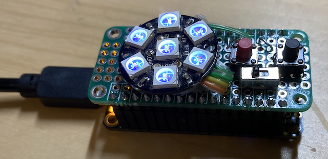
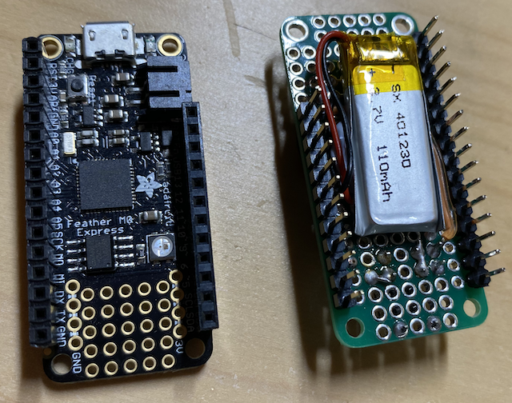

# Video_Conference_Light
Neopixel light with up/down keys for brightness adjustment

# Components

* NeoPixel Jewel - 7 x 5050 RGB LED with Integrated Drivers
https://www.adafruit.com/product/2226

* Push button x 2
* Slide switch
* 110mAh LiPo battery

# Connections

NeoPixel Jewel power line is connected to VBAT
NeoPixel Jewel data-in is connected to #6
Push buttons are connected to #10 and #5 (the other sides are GND)
Slide switch is connected in between LiPo and VBAT

This setup requires a LiPo battery all the time even you power it by USB.
Advantage is that you can connect USB for long time usage (and charge the battery). You can disconnect USB and still be able to use it for some time. You can turn off by the slide switch to completely disconnect Neopixels, preventing discharge.
